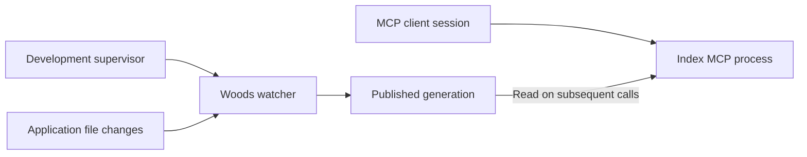

# Woods with minimal manual maintenance

**Recommended development setup:** create a baseline index, run one supervised
watcher per active application/worktree index, and let your MCP client launch the
Index Server. The watcher publishes changes; an already connected Index Server
reads the new generation on its next call. Ordinary edits then need no manual
extraction or MCP restart.

This page maps that workflow to its canonical documentation. The raw watcher and
hooks are available in Woods `2.0.0.beta4`; the managed launcher, installation
generator, and Puma adapter are **unreleased after `2.0.0.beta4`**. Check the
installed gem/revision and plugin separately. Installing the gem or registering
an MCP connection does **not** enable automatic index maintenance.

## 1. Where each part is documented

| What you need | Documentation section | What it defines |
|---|---|---|
| First extraction and validation | [Getting started: extract](GETTING_STARTED.md#3-extract-the-application) and [validate](GETTING_STARTED.md#4-validate-and-inspect-the-index) | Establish a usable baseline before connecting tools. |
| The simplest automatic workflow | [Getting started: keep the index current](GETTING_STARTED.md#keep-the-index-current) | Watcher beside Rails, process-manager example, automatic reader refresh. |
| Agent-operated installation | [Agent setup: automatic maintenance](AGENT_SETUP.md#8-offer-automatic-index-maintenance) | Add a watcher using the application's existing development process convention. |
| Starting and supervising the watcher | [Managed development startup](WATCH_DAEMON.md#managed-development-startup), [raw task](WATCH_DAEMON.md#running-it), and [restart triggers](WATCH_DAEMON.md#restart-triggers) | Native/Puma installation, external supervision, and restart after exit 75. |
| Updating or removing automatic startup | [Owned installation](WATCH_DAEMON.md#ownership-updates-and-removal) | Portable receipt, preserved application files, explicit updates/removal, and worktree-safe ownership. |
| Catching changes made while stopped | [Watch daemon: startup reconciliation](WATCH_DAEMON.md#startup-is-not-a-clean-slate) | Catch-up before normal watching, including missed changes and deletions. |
| Running inside Docker | [Docker: extraction](DOCKER_SETUP.md#extraction) and [index persistence](DOCKER_SETUP.md#index-persistence) | Container-side execution, polling, shared paths, and persistent output. |
| Connecting the reader | [MCP: stdio client](MCP_SERVERS.md#configure-a-stdio-client) and [Docker process/path rule](MCP_SERVERS.md#docker-process-and-path-rule) | Client-owned process startup and paths visible to that process. |
| Seeing new generations without reconnecting | [Watch daemon: freshness contract](WATCH_DAEMON.md#the-freshness-contract) | Publication and automatic reader refresh. |
| Optional refresh after agent edits | [Edit client adapters](CLIENT_HOOKS.md) and [hook operation](WATCH_DAEMON.md#hooks-for-agent-sessions) | Registration, supported edit events, durable queue, retries, and Docker execution. |
| Session checks and optional context hints | [Source freshness: containers and hooks](SOURCE_FRESHNESS.md#containers-and-hooks) and [bounded context hints](WATCH_DAEMON.md#optional-bounded-context-hints) | Freshness warnings and separately enabled context delivery. |
| Defaults and environment variables | [Watch settings](CONFIGURATION_REFERENCE.md#watch-daemon-woodswatch) and [plugin hook settings](CONFIGURATION_REFERENCE.md#opt-in-plugin-refresh-hooks) | Authoritative variable names, defaults, and enablement rules. |
| Worktrees and separate containers | [Multiple worktrees](WATCH_DAEMON.md#multiple-worktrees), [cross-host liveness](WATCH_DAEMON.md#cross-host-liveness), and [MCP worktree setup](MCP_WORKTREE_SETUP.md) | Separate index ownership, reader registration, and heartbeat trust. |
| Grove-managed worktree switching | [Grove integration below](#grove-coordinate-the-watcher-with-worktree-switches) and [Grove's external Docker integration](https://github.com/lost-in-the/grove/blob/cf833e65c6d2525b0fafa91ebeea9be6455decdb/plugins/docker/README.md#external-mode) | Include the watcher in the services Grove starts against the selected worktree. |
| Diagnosing stale or uncertain answers | [Source freshness: read the result](SOURCE_FRESHNESS.md#read-the-result) and [troubleshooting](TROUBLESHOOTING.md#source-freshness-is-unknown-or-drifted) | Distinguish content drift, incomplete evidence, age, and daemon health. |

## 2. What starts what

| Component | Started by | Responsibility |
|---|---|---|
| Rails application | Your development process manager or Compose | Runs the application; a configured development Puma adapter also starts Woods' separate launcher. |
| Managed `woods-watch` | Selected Foreman command or opt-in Puma adapter | Owns a fresh extraction child and handles planned restarts without stopping Rails. |
| `woods:watch` | A separately configured supervisor/service | Boots Rails, catches up missed changes, watches files, and publishes structural generations. |
| Index MCP over stdio | Your editor or agent's MCP client | Reads the published index. It does not boot Rails or launch a watcher. |
| Post-edit refresh hook | A supported client edit event, after opt-in | Requests extraction for relevant edits; an active watcher can cause it to defer. |
| Session-start hook | A supported client session event, after opt-in | Checks source freshness and warns. It does not extract or revive a stopped watcher. |
| Optional context hook | Supported client events, after separate opt-in | Supplies bounded orientation or impact hints. It does not enable refresh. |

Console MCP is a separate, optional live-data tool. Its HTTP transport can be
mounted in Rails when enabled, but that does not maintain the structural index.
See [the server distinction](MCP_SERVERS.md#choose-a-server).

## 3. Recommended setup for daily work

1. **Create and validate the initial index.** Follow the first two links in the
   table. If verified fresh-boot provenance matters, use the
   [fresh-process extraction launcher](SOURCE_FRESHNESS.md#establish-a-fresh-baseline).
2. **Add a resident watcher to development startup.** Follow the canonical
   [mode selection and preview](WATCH_DAEMON.md#managed-development-startup): Puma
   for simple Rails startup, verified Foreman for an existing Procfile workflow,
   or the existing external supervisor for Docker/Grove. Preserve `bin/dev` and
   record the actual startup command. Keep catch-up enabled and idle TTL unset.
3. **Make writer and reader share the intended index.** In Docker, preserve the
   application's required source, bundle, configuration, and git mounts. Persist
   the index across container replacement. Use polling when bind-mount events
   are unreliable. Follow the linked Docker guide instead of copying a generic
   service that might replace required inherited settings.
4. **Register the Index MCP client once for the correct worktree.** The client
   starts the reader for its session. A container-based launcher requires its
   target container to be running; registering MCP does not start Docker.
5. **Prove one automatic update.** Make a reversible edit, observe successful
   publication, and query the changed unit through the existing MCP connection.
   Repeat once across watcher restart and worktree switch if those are routine.

For sustained work, the resident watcher detects changes to supported application
files regardless of which editor or agent made them. Do not enable post-edit
refresh hooks merely to make the watcher faster: hooks can defer to it and retain
queued events.

The watcher maintains the structural index. Semantic vectors need their own
`woods:embed_incremental` workflow. For provider-free ranked retrieval, consider
[explicit lexical mode](RETRIEVAL_GUIDE.md#embedding-free-lexical-retrieval), which
uses published extraction units without a separate embedding pipeline.

### Docker: verify the resolved service

Inspect the result of `docker compose config` using the same files, environment,
and active worktree as normal startup. Keep resolved secrets out of shared logs.

- **Preserve inherited settings.** Within a YAML anchor merge, an explicit
  `volumes:` or `environment:` key replaces that inherited value. Across Compose
  files, volume entries merge by container target. A separate override can add
  the index mount while retaining the base service's application and bundle
  mounts. Verify the resolved result, including any inherited ports or web-only
  healthcheck. See Docker's [YAML fragments](https://docs.docker.com/reference/compose-file/fragments/)
  and [Compose-file merge rules](https://docs.docker.com/reference/compose-file/merge/).
- **Choose restart behavior deliberately.** `on-failure` restarts exit 75, but
  does not restart the container after the Docker daemon restarts. For recovery
  after Docker/OrbStack restarts while respecting an intentional stop, use
  `unless-stopped`. See [Docker restart policies](https://docs.docker.com/engine/containers/start-containers-automatically/).
- **Check database readiness.** The short `depends_on` form orders startup; it
  does not wait for the database to accept connections. Use the application's
  existing readiness convention, such as `service_healthy` with a database
  healthcheck, and reference the Compose service key. See
  [Compose startup order](https://docs.docker.com/compose/how-tos/startup-order/).
- **Verify catch-up and worktree switching.** A running container does not prove
  its first extraction finished. Confirm successful publication and the intended
  source/index paths before calling the setup current. Recreate the watcher with
  the other application services when the active worktree changes.

Use the application's actual Rails task entrypoint. An application whose root
`Rakefile` wraps Docker may require `bundle exec rails woods:watch` instead of
`bundle exec rake woods:watch`; verify the command inside the application container.

### Grove: coordinate the watcher with worktree switches

When using [Grove](https://github.com/lost-in-the/grove) with an external Compose
stack, Grove supplies the worktree-switch lifecycle. Its Docker integration
persists the selected worktree in the configured environment file and runs
`docker compose up -d` for the configured services. Compose recreates services
whose resolved configuration changed, including changed bind-mount paths.

- Add the watcher service to the existing
  `[plugins.docker.external].services` list in `.grove/config.toml`, preserving
  the other entries. The service must also exist in the Compose configuration.
- Keep the application's source mount and index mount tied to the same
  worktree variable configured by `env_var`. Confirm the MCP launcher reads
  that worktree's index too.
- Check `plugins.docker.enabled`, `auto_start`, `auto_stop`, and
  `switch.container_switch`. With automatic lifecycle enabled, a normal
  `grove to <worktree>` switch stops the configured old services and brings them
  up against the selected tree. Updating the environment file alone does not
  reconfigure an already running container.
- If using isolated agent stacks, check their separate
  `[plugins.docker.external.agent].services` list and Compose template as well;
  the shared stack's watcher configuration is not sufficient for those slots.

The ownership chain is **Grove selects the worktree and starts its services →
Docker supervises the watcher → Woods catches up and publishes file changes**.
The MCP client starts the reader, which reloads published generations. This setup
needs no additional Woods-starting Grove hook when its Docker integration already
manages the watcher. Verify a switch by observing an edit in the new tree while
the previous tree's index stays unchanged.

See Grove's [Docker lifecycle documentation](https://github.com/lost-in-the/grove/blob/cf833e65c6d2525b0fafa91ebeea9be6455decdb/plugins/docker/README.md#hook-integration)
and [external-stack configuration examples](https://github.com/lost-in-the/grove/blob/cf833e65c6d2525b0fafa91ebeea9be6455decdb/docs/CONFIGURATION_REFERENCE.md#rails-project-with-external-docker).
These links pin the Grove revision checked for this guide; compare with
`grove version` when diagnosing a different installation.

### Cross-container status is different from an extraction lock

When a watcher and a status-checking process share an index but have different
hostnames, `WOODS_WATCH_TRUST_FOREIGN_HOST=1` lets that process use the watcher's
fresh heartbeat. Set it inside the relevant MCP/task container or pass it through
the launcher; setting it only in the host shell or watcher does not configure
other containers. This is bounded heartbeat trust, not proof the remote process
still exists: a stopped daemon can remain believable for up to 15 minutes.

| Operation | Effect of the running watcher |
|---|---|
| Ordinary Index MCP reads | Read published generations without acquiring the extraction writer lock. Foreign-host trust is not required to read or reload an index. |
| `woods_status` / `woods:watch_status` | Foreign-host trust affects daemon liveness reporting. A live but degraded daemon is not evidence that updates are succeeding. |
| `woods:incremental` | Can stand down when a trusted running daemon covers the index; a degraded daemon does not provide that coverage. |
| Post-edit hook refresh | Can defer with exit 75 while retaining its queued work. |
| Manual `woods:extract` or named refresh | Acquires the shared writer lock. An idle watcher does not hold it; an active extraction can make the manual task wait. |

The default writer-lock wait is up to 600 seconds, configurable with
`WOODS_LOCK_WAIT`; failure to acquire it exits nonzero. It is not a mandatory
delay whenever a watcher exists. Heartbeat trust does not bypass the lock.
See [writer coordination](WATCH_DAEMON.md#within-one-worktree-writers-serialize)
and [cross-host liveness](WATCH_DAEMON.md#cross-host-liveness).

## 4. When hooks are useful instead

Post-edit hooks suit occasional agent edits when keeping another Rails process
resident is undesirable. They cover the registered client events, not arbitrary
shell commands, git operations, or edits from another application. They are not
a substitute for a watcher when all filesystem changes need automatic coverage.

Follow [client registration](CLIENT_HOOKS.md), then verify:

- `WOODS_HOOKS_ENABLED=1` reaches the process launching the client;
  `WOODS_HOOKS_DISABLED=1` overrides it.
- The installed gem supports the hook task and a baseline index already exists.
- `WOODS_HOOK_RAKE` runs in the application's real environment; Docker-only
  bundles need a container command prefix or wrapper.
- The hook can see the intended index and map edits to the correct application.
- A supported edit produces a successful publication, not just a hook callback.
  Inspect `hook.log` and `hook-pending/` when work is deferred or fails.

`WOODS_HOOK_CONTEXT_ENABLED` is a separate opt-in. Neither context hints nor a
quiet session-start check establish that anything is refreshing the index.
Use the settings and recovery links above for the full contract.

## 5. A low-interaction setup is complete when

- Development startup starts the intended watcher through its supervisor.
- Missed changes are reconciled when the watcher starts again.
- Edits, creates, and deletes appear through the existing MCP connection.
- A worktree switch changes both the watched source and the served index.
- A failed edit retains the last good generation and reports the degraded state;
  correction allows recovery without discarding the index.
- The handoff separately records watcher supervision, post-edit hooks, session
  checks, context hints, MCP registration, and any embedding refresh workflow.

Check `woods_status` before relying on indexed facts. Daemon liveness and an old
publication timestamp do not by themselves establish source freshness. Even a
working watcher can report `unknown` source evidence, including an unverified
boot boundary; read the reason before deciding what to refresh. See
[source-freshness scope](SOURCE_FRESHNESS.md#scope-and-partial-extraction).

Automatic revival after a raw task's idle shutdown requires a separately
configured supervisor or startup hook; the shipped SessionStart hook does not
do it. Managed mode rejects idle TTL. Confirm the selected startup integration
and a successful publication before claiming automatic maintenance is active.
