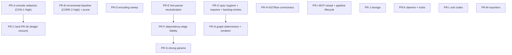

# 07. Suggested fixes

Fifteen grouped PRs plus a deferral list. Every finding in 03-05 has exactly one disposition row at the bottom.

Same contract as the prior plan: failing test first, quoted red output in the PR, docs and CHANGELOG ride the behavior PR, `bin/rake spec` and `bin/rubocop` clean, opt-in lane run where behavior depends on it.

## Wave order

- **Wave 1 (release-blocking)**: PR-A, PR-B, PR-C. Tag nothing before these.
- **Wave 2 (strongly recommended for 2.0)**: PR-D, PR-H (EXTB-4 at least), PR-I (MCP-1/2/3), PR-E (EXTA-1 at least), PR-F (EXTA-2 at least), PR-J (STO-1/2).
- **Wave 3 (2.0.x acceptable)**: the rest.

## The PRs

### PR-A `fix/console-redaction-header-collision`: CON-1 (High), CON-3, CON-5, R1-6. Size S-M.
Alias may not name a protected output header; redactor treats duplicate headers as ambiguous and masks defensively; casecmp in the select-side refusals; redact-then-truncate in AuditLogger. Rollback: revert restores the leak; pre-release only.

### PR-B `fix/incremental-baseline-and-prune`: CORE-2 (High), CORE-1, EXTA-3. Size M.
Refuse `extract_changed` over an unpublished marker with no graph (rake exits non-zero; daemon path exempt). Prune leftovers by (identifier, type). Job class-discovery returns nil instead of a fabricated path (the GraphQL precedent). Booted lane: run the equivalence oracle. Rollback: revert restores silent behavior; no format change.

### PR-C `fix/console-reliability`: G-3, L9, L10, L11; closes R1-4. Size S.
The original PR-2b content, red specs already specified in the prior plan. Depends on PR-A (same files). Rollback: none needed.

### PR-D `fix/encoding-family-sweep`: INF-3, R1-1, EXP-7, R2-3. Size S.
UTF-8 reads in feedback store, session-tracer FileStore (including the :155 legacy path), QuerySet load/save, and the P5 guard spec. One shared non-ASCII-under-US-ASCII spec helper. Add the C-locale CI job from 06. Rollback: none needed.

### PR-E `fix/line-parser-neutralization`: EXTA-1, EXTB-1, EXTB-2, STO-3, EXTB-17, EXTA-14. Size M.
One shared quote-and-comment-aware line neutralizer (extend `strip_line_comment`), applied in SourceNesting, RakeTaskExtractor, FactoryExtractor, SemanticChunker, StateMachineExtractor. `=begin` handling in both SourceNesting and the chunker; `[[:upper:]]` identifiers. Risk: identifier changes on hosts currently mis-parsed; attach a before/after identifier diff like PR-3 did. Rollback: revert restores the mis-parses.

### PR-F `fix/dependency-edge-fidelity`: EXTA-2, EXTA-4, EXTA-6, EXTA-8, EXTB-3, EXTB-9, EXTB-12, EXTA-10, R1-5. Size M. Depends on PR-E (shared scanner files).
Namespace-capable captures for service/job/mailer scanners; one shared enqueue pattern (Job|Worker, set-chains); `||=`/`+=` writes; body stripping before callback scans; Wisper paren form; quoted rake dependencies; single-quoted whenever; flip the EXTA-10 pinned spec. Risk: new edges shift PageRank slightly; note in CHANGELOG. Rollback: revert loses the new edges only.

### PR-G `fix/strong-params-capture`: EXTA-5/R1-2, EXTA-12, R1-3. Size S. Depends on PR-F ordering only for file overlap.
Fluent-chain joint; hash-key capture with a documented flat-list contract.

### PR-H `fix/ast-flow-correctness`: EXTB-4, EXTB-5, EXTB-15, EXTB-16, EXTB-13, EXTB-14. Size M.
Unless slot swap (or `kind: 'unless'`); call-argument children; positional case children; block-receiver recursion; `require 'time'`; YARD fix. Risk: flow documents change shape for unless; consumers tolerate nil holes already. Rollback: revert restores inverted flows (documented wrong state).

### PR-I `fix/mcp-reload-and-pipeline-lifecycle`: MCP-1, MCP-2, MCP-3, MCP-4, MCP-5, MCP-6; lows MCP-7, MCP-8, MCP-9. Size L; consider splitting MCP-5 (concurrency) out as its own PR-I2, mirroring the 6a/6b split.
No-dump reload = zero-count success; every early return still reloads the reader; rescue-and-finish around pipeline_start; bounded-age adoption for foreign-boot working tasks (flip the pinning spec); pending-refresh gate for pinned overlap; StoreError translation at the pipeline boundary. Lane: http_server (executed here, green baseline exists). Rollback per sub-fix; MCP-5's gate returns to unbounded staleness on revert.

### PR-J `fix/storage-legacy-and-foreign-data`: STO-1, STO-2, STO-4, STO-9, STO-11, STO-12, STO-6, STO-13, STO-15. Size M.
Legacy schema-migrations rename before ensure_table (fixture corrected first: it currently pins an impossible state); foreign-point skip in reconciliation; typed Metadata truncation guards; blank-type reject; implements_own? guards; doc/spec hygiene; dimensions guard; UUID5 binary passthrough; ReadTimeout rescue. Lane: live backends for the Qdrant half (not executable here; testbed). Rollback: revert restores the wedge and the foreign deletes.

### PR-K `fix/daemon-locks-residuals`: INF-1, INF-2, INF-7, INF-10, INF-11, INF-12, CORE-4, CORE-6, EXTB-10. Size M.
Fallback watcher gets the ignore list; retry drain under LockHeartbeat (or its own thread); unlink on failed acquire write; dangling-payload watermark; verify-before-delete claim release; git-ENOENT decision shape; bounded pin retry; realpath payload boundary; pagerank fetch default. Rollback: none needed; all fail-safe hardening.

### PR-L `fix/sync-exit-codes`: INF-4 (+EXP-4). Size S.
`exit 1` on errors for embed, embed_incremental, notion_sync, mirroring unblocked's partial-progress nuance. Subprocess rake specs. Rollback: revert restores green-while-broken.

### PR-M `fix/exporter-correctness`: EXP-1, EXP-2, EXP-3, EXP-5, EXP-6, EXP-9, EXP-11, EXP-10. Size M.
Physical-column grouping for STI; UTF-16 truncation; migration_version for Last Schema Change; pinned-generation export; escaped vault glob; NameMapper re-check + reserved names; columns-only warning; completeness metric decision. Risk: EXP-1 changes page grouping for STI hosts; note the one-time re-sync in CHANGELOG. Rollback: revert restores churn.

### PR-N `fix/graph-determinism-and-renderer`: EXTB-6, EXTB-7, EXTB-11. Size S.
Renderer normalizes current-format edges (flip the pinning spec, regenerate docs/self-analysis); fixed-point orphan assignment (extend the rotation fixture); deep-frozen to_h memo. Rollback: renderer revert restores edge-less maps.

### PR-O `test/spec-hygiene-and-bookkeeping`: R2-2, STO-5, INF-8, INF-9, EXP-8, root-guard for the three permission specs, STO-8 shared examples. Size S. Wave 1-adjacent (no behavior change).
Seven backlog entries for the deferred lows; standalone-require shims plus a require-in-isolation sweep in load_order_spec; skip-if-root guards; adapter-parity shared examples.

## Deferral list (into docs/backlog.json, with IDs, per the plan contract)

| Finding | Reason |
|---|---|
| EXTA-7 (zeitwerk < 2.6.4) | Decision needed (fallback vs documented floor); document in UPGRADING_TO_2 now, decide in 2.0.x. |
| EXTA-9 (namespaced concern inlining) | Behavior improvement, not regression; fold into the concern-inlining backlog family. |
| EXTA-11 (phantom params) | Prism-based parameter parsing is the right fix; small design. |
| EXTA-13 (ignored-prefix true edges) | Behavior change to edge emission; needs a host-app false-positive re-check. |
| EXTA-15 (mailer guards) | Needs a booted no-ActionMailer host to validate; testbed work. |
| EXTB-8, EXTB-18, EXTB-19 | Metadata completeness; ordinary backlog. |
| MCP-10 (self-healing doc) | Doc-only; ride any MCP PR. |
| CON-4 (scope-array dialect strip) | Unreachable through the registered schema; defense-in-depth batch. |
| STO-7, STO-10, STO-14 | Latent/config-shape items; backlog with the probe evidence attached. |
| INF-5, INF-6, INF-13, R2-5, R2-6 | Bounded operational items; backlog. |
| R2-4 (ReDoS floor) | Decide: coarse deadline on 3.0/3.1 or a release-note exclusion. |

## Disposition table

| Finding | Disposition | Finding | Disposition | Finding | Disposition |
|---|---|---|---|---|---|
| CORE-1 | PR-B | EXTB-6 | PR-N | STO-6 | PR-J |
| CORE-2 | PR-B | EXTB-7 | PR-N | STO-7 | deferral |
| CORE-3 | deferral | EXTB-8 | deferral | STO-8 | PR-O |
| CORE-4 | PR-K | EXTB-9 | PR-F | STO-9 | PR-J |
| CORE-5 | deferral | EXTB-10 | PR-K | STO-10 | deferral |
| CORE-6 | PR-K | EXTB-11 | PR-N | STO-11 | PR-J |
| EXTA-1 | PR-E | EXTB-12 | PR-F | STO-12 | PR-J |
| EXTA-2 | PR-F | EXTB-13 | PR-H | STO-13 | PR-J |
| EXTA-3 | PR-B | EXTB-14 | PR-H | STO-14 | deferral |
| EXTA-4 | PR-F | EXTB-15 | PR-H | STO-15 | PR-J |
| EXTA-5 | PR-G | EXTB-16 | PR-H | INF-1 | PR-K |
| EXTA-6 | PR-F | EXTB-17 | PR-E | INF-2 | PR-K |
| EXTA-7 | deferral | EXTB-18 | deferral | INF-3 | PR-D |
| EXTA-8 | PR-F | EXTB-19 | deferral | INF-4 | PR-L |
| EXTA-9 | deferral | MCP-1 | PR-I | INF-5 | deferral |
| EXTA-10 | PR-F | MCP-2 | PR-I | INF-6 | deferral |
| EXTA-11 | deferral | MCP-3 | PR-I | INF-7 | PR-K |
| EXTA-12 | PR-G | MCP-4 | PR-I | INF-8 | PR-O |
| EXTA-13 | deferral | MCP-5 | PR-I (or I2) | INF-9 | PR-O |
| EXTA-14 | PR-E | MCP-6 | PR-I | INF-10 | PR-K |
| EXTA-15 | deferral | MCP-7 | PR-I | INF-11 | PR-K |
| CON-1 | PR-A | MCP-8 | PR-I | INF-12 | PR-K |
| CON-2 | PR-A or PR-C | MCP-9 | PR-I | INF-13 | deferral |
| CON-3 | PR-A | MCP-10 | deferral | EXP-1 | PR-M |
| CON-4 | deferral | STO-1 | PR-J | EXP-2 | PR-M |
| CON-5 | PR-A | STO-2 | PR-J | EXP-3 | PR-M |
| R1-1 | PR-D | STO-3 | PR-E | EXP-4 | PR-L |
| R1-2 | PR-G | STO-4 | PR-J | EXP-5 | PR-M |
| R1-3 | PR-G | STO-5 | PR-O | EXP-6 | PR-M |
| R1-4 | PR-C | R2-2 | PR-O | EXP-7 | PR-D |
| R1-5 | PR-F | R2-3 | PR-D | EXP-8 | PR-O |
| R1-6 | PR-A | R2-4 | deferral | EXP-9 | PR-M |
| G-3 | PR-C | R2-5 | deferral | EXP-10 | PR-M |
| L9/L10/L11 | PR-C | R2-6 | deferral | EXP-11 | PR-M |

Note: CON-2 (dialect-blind handler) sits naturally with either console PR; it must land before any MySQL-host testbed validation of the console, or that validation tests the dead path.

## Go/no-go for the 2.0.0 tag

1. PR-A, PR-B, PR-C merged; their regression specs green on the tag commit.
2. Every finding above holds a disposition (this table), and every deferral has a backlog ID (PR-O).
3. The booted lane and live-backends lane run green after PR-B and PR-J respectively (not executable in this audit's environment).
4. The C-locale CI job (PR-D) green.
