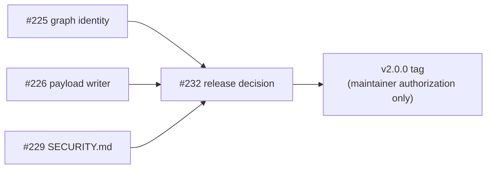

# v2.0.0 launch blockers — implementation plan

Status: draft, 2026-08-20. Covers GitHub issues #225, #226, #229.
Base: `main` at `75288f2` (merge of PR #224).

## Bottom line

Two code blockers stand between `main` and a v2.0.0 tag, plus one policy
decision that only the maintainer can make.

| Item | Kind | Gate |
|---|---|---|
| #225 typed graph identity | code | blocks #232 |
| #226 atomic payload writer | code | blocks #232 |
| #229 `SECURITY.md` supported versions | policy | maintainer decision |
| #232 release decision | process | needs the three above |

#227, #228, #230, #231 are post-2.0 follow-ups. They are not release gates.

## Verified starting state

Both reproducers are RED right now, for the reasons their comments claim:

```
1) Woods::DependencyGraph identifier collision across types
   expected [] to include "reports"          # type_index entry was destroyed
2) Publication atomicity a flat index has no atomic boundary
   expected: [1, "v1"]  got: [1, "v2"]       # torn read across a partial publish
85 examples, 0 failures, 2 pending
```

### Local run command

The repo has no `.bundle/config` and this machine's `mise activate` only fires
for interactive shells, so a non-interactive agent shell lands on system Ruby
2.6 and fails on the lockfile. Use:

```bash
export PATH="$HOME/.local/share/mise/shims:$PATH"
export BUNDLE_PATH="$PWD/vendor/bundle"
LANG=C bin/rspec <files>
```

`LANG=C` is not optional: the suite is a live canary for encoding bugs.

---

## #225 — Graph nodes collapse across types

### The defect

`DependencyGraph#register` calls `unregister(unit.identifier)` whenever the
identifier is already present, regardless of type. `unregister` strips the
previous unit's reverse edges, `file_map` entry and `type_index` entry. So a
Scenic view `reports` registered before a factory `reports` is **destroyed**,
not shadowed.

The on-disk index does not have this problem: units are written to
`<extractor_key>/<identifier>.json`, so `database_view/reports.json` and
`factory/reports.json` already coexist. Only the graph collapses them.

### Design: primary node plus variants

Keep the identifier as the persisted key. Carry the extra nodes in a sibling
section that is **omitted when empty**, so `to_h` for a non-colliding graph is
byte-identical and every existing `dependency_graph.json` loads unchanged.

In-memory shape changes, two hashes only:

```ruby
@nodes = {}   # identifier => { type => { type:, file_path:, namespace: } }
@edges = {}   # identifier => { type => [{ target:, via: }] }
```

`@reverse`, `@reverse_via`, `@file_map` and `@type_index` keep their current
shape. They are already identifier-valued sets, which is exactly what the
reproducer wants: the view and the factory each contribute `'reports'` to
their own type bucket and their own path.

Persisted shape:

| Key | Change |
|---|---|
| `nodes` | unchanged — holds the **primary** node |
| `edges` | unchanged — holds the primary's edges |
| `reverse`, `file_map`, `type_index` | unchanged |
| `stats.node_count` | counts units, not identifiers (differs only when colliding) |
| `variants` | **new**, an array, emitted only when non-empty |

Each variant entry is `{ identifier, type, file_path, namespace, edges }`.

**The primary is the sorted-first type**, never registration order. The repo
already requires that two extractions of one tree publish identical analysis
(`GraphAnalyzer` determinism note in `CLAUDE.md`); registration order would
make a full and an incremental run disagree.

### API

| Method | Change |
|---|---|
| `node(identifier, type: nil)` | `type:` is exact; without it, the primary |
| `node_types(identifier)` | new — sorted `Array<Symbol>` |
| `nodes_for(identifier)` | new — every node, sorted by type |
| `units_for_path(path)` | new — `Array<[identifier, type]>` |
| `dependencies_of(identifier, via:, type: nil)` | union across types when `type` is nil |
| `remove(identifier, type: nil)` | all types when nil, one when given |
| `dependents_of`, `affected_by`, `units_of_type`, `identifiers_for_path` | signature unchanged |

Union rather than primary-only for `dependencies_of` is deliberate: the caller
is blast-radius computation, and a superset is safe where a subset silently
under-extracts. For a non-colliding identifier — every identifier in every
real index today — union is the same single list.

### Files

| File | Change |
|---|---|
| `lib/woods/dependency_graph.rb` | the shape and API above, plus `to_h`/`from_h` |
| `lib/woods/extractor.rb` | type-aware pruning and rewriting (below) |
| `lib/woods/mcp/index_reader.rb` | merge `variants` when serving traversal |
| `lib/woods/mcp/server.rb` | `dependencies`/`dependents` disambiguate explicitly |
| `spec/dependency_graph_spec.rb` | un-pend the reproducer, add round-trip cases |
| `spec/extractor_spec.rb` | type-aware removal cases |
| `CLAUDE.md` | replace the "Known, pre-existing" gotcha with the new contract |

`deduplicate_results` needs no change — it already dedupes within a type,
which matches the on-disk layout. The ambiguity lives in the graph, not there.

`GraphAnalyzer` needs no change: it works purely through `dependencies_of` /
`dependents_of` / identifiers.

### Extractor callsites

Every one of these currently reads `node(identifier)[:type]` and would pick the
wrong unit under a collision:

| Line | Method | Fix |
|---|---|---|
| ~1746 | `prune_path_leftovers` | iterate `units_for_path` pairs |
| ~1858 | `stale_class_based_units` | `node_types(id).include?(type)` |
| ~2027 | `prune_paths` | iterate `units_for_path` pairs |
| ~2089 | `convention_path_unit?` | take `type` as a parameter |
| ~2148 | `remove_unit` | take `type:`, delete only that type's JSON |
| ~2208 | `rewrite_unit_json` | rewrite each of the identifier's types |
| ~2246 | `incremental_git_data` | collect paths across all types |
| ~2276 | `re_extract_unit` | re-extract each type |

### Steps (TDD, one commit each)

1. **Graph internals.** Reshape `@nodes`/`@edges`, make `unregister`
   type-scoped, keep every existing spec green. Un-pend the reproducer.
2. **Serialization.** `to_h` emits `variants`; `from_h` reads it. Add a
   round-trip spec and a "legacy file with no `variants` loads unchanged" spec,
   plus a byte-identity spec for the non-colliding case.
3. **Read API.** `node_types`, `nodes_for`, `units_for_path`, `type:` on
   `node`/`dependencies_of`/`remove`.
4. **Extractor.** Convert the eight callsites. The oracle is
   `spec/integration/incremental_equivalence_spec.rb` (`:booted_app`).
5. **MCP.** `IndexReader` merges variants; the traversal tools report the type
   alongside each identifier instead of silently picking one.
6. **Docs.** `CLAUDE.md` gotcha, `docs/INCREMENTAL_EXTRACTION.md` if the
   dispatch contract wording moves.

---

## #226 — Atomic generation payload, writer half

### The defect

`generation.json` flips atomically, but it points at a directory of
independently-written files. A reader that refreshes mid-publish can load a
unit from N+1 next to a graph from N.

The reader half already landed: `Generation` carries an optional `payload`
pointer and `IndexReader` resolves every artifact through the directory the
observed generation names, degrading to the flat root on an absent, stale or
escaping pointer.

### Design: hardlinked per-generation payload directories

Publish into `payloads/gen-<N>/`, then bump with `payload:`. That single atomic
write of `generation.json` becomes the one commit point.

```
tmp/woods/
├── generation.json          → { "payload": "payloads/gen-42", ... }
└── payloads/
    ├── gen-41/              (superseded, still whole, pinned readers safe)
    └── gen-42/
        ├── manifest.json
        ├── dependency_graph.json
        ├── graph_analysis.json
        └── <type>/*.json
```

- **Full run** writes everything into a fresh `gen-<N+1>`.
- **Incremental run** builds `gen-<N+1>` by **hardlinking** every file from the
  current payload, then applies the run's writes and deletes inside it.

Hardlinking is what makes this cheap enough to do every cycle, and it is safe
for exactly one reason: every writer goes through `AtomicFile.write`, which
renames a fresh tempfile over the path. A rename replaces the *directory
entry*, it does not mutate the inode, so the old generation's file survives
intact. **A bare `File.write` anywhere on the write path would corrupt the
previous generation in place.** That invariant needs a spec, not a comment.

### Retention

Keep the last `WOODS_PAYLOAD_RETENTION` (default 3) generations, and never
prune a directory younger than a grace window — a reader holding a pin has the
old directory open and pruning underneath it is the torn read we just removed,
wearing a different hat. Prune under `PipelineLock`, like every other writer.

### Migration and back-compat

An existing flat index keeps working: no pointer, reader falls back to root.
The first run after upgrading publishes a payload directory and the index
becomes atomic from then on. Flat artifacts left at the root are stale but
harmless; `woods:clean` removes them.

**Open question for review:** whether the payload writer ships on by default in
2.0 or behind a config flag for one release. Default-on is the honest fix and
the reader half already tolerates both; default-off means shipping 2.0 with the
gap still live. Recommendation: default-on, since the layout change is confined
to the output directory and every in-repo reader is migrated in step 3 below.

### Files

| File | Change |
|---|---|
| `lib/woods/extractor.rb` | publish into a payload dir; pass `payload:` to `bump!` |
| `lib/woods/index_artifact.rb` | payload dir creation, hardlink clone, retention |
| `lib/woods/embedding/indexer.rb` | exclude `payloads/` from the `**/*.json` glob |
| `lib/woods/obsidian/vault_exporter.rb` | resolve through the pointer |
| `lib/woods/unblocked/exporter.rb` | resolve through the pointer |
| `lib/woods/notion/*` | resolve through the pointer |
| `lib/woods/resilience/index_validator.rb` | resolve through the pointer |
| `lib/woods/watch/daemon.rb` | resolve through the pointer |
| `lib/tasks/woods.rake` | `woods:clean` and `woods:validate` payload-aware |
| `spec/integration/publication_atomicity_spec.rb` | see below |

The five flat-layout readers should not each grow their own resolution logic.
Factor the resolution `IndexReader` already performs into a shared
`Woods::PayloadResolver` and have all six use it.

### The pinned example

The existing pending example builds a **flat** index by hand and asserts
atomicity, so no writer change can make it pass as written. Handling it
honestly, in two parts:

1. Keep it, un-pended, with its assertion inverted to what is actually true and
   permanent: a legacy flat index is non-atomic **by design**, and that is the
   reason the payload layout exists.
2. Add a new example that drives the real writer end to end: publish, then
   straddle a partial second publish, and assert the reader sees the whole old
   generation.

Rewriting a pinned reproducer to make it pass is normally the wrong move. It is
right here only because the comment on that example says explicitly that it
pins *remaining work*, and the remaining work is a layout the example does not
use. **Flagged for maintainer review before step 1 lands.**

### Steps (TDD, one commit each)

1. `IndexArtifact` payload directory: create, hardlink-clone, retention. Spec
   the "AtomicFile.write does not disturb the previous generation" invariant.
2. `Extractor` publishes into it and passes `payload:` to `bump!`. New
   writer-driven atomicity spec goes RED then GREEN here.
3. `PayloadResolver` plus the five flat readers and the indexer glob.
4. Rake tasks, retention config, `docs/` and `CLAUDE.md`.

---

## #229 — `SECURITY.md` supported versions

Not code. `SECURITY.md` currently does not state a supported-versions policy.
The decision is whether to advertise `2.0.x` as the supported line, and what
happens to `1.x`.

**Needs Leah.** Three shapes, pick one:

| Option | Policy |
|---|---|
| A | `2.0.x` only. Cleanest, tells 1.x users to upgrade. |
| B | `2.0.x` supported, `1.x` security-only for a stated window. |
| C | No version table; report-and-we-triage. |

The historical design snippets half of #229 is mechanical and can proceed
without this decision.

---

## Sequencing



#225 and #226 are independent and could run in parallel, but they both touch
`lib/woods/extractor.rb` heavily. Sequential, #225 first: it is the smaller
change and it settles the graph API that #226's payload writer serializes.

## Verification before #232

- Full suite green under `LANG=C`, pending allowlist down by two.
- `spec/integration/incremental_equivalence_spec.rb` with
  `WOODS_RUN_BOOTED_APP=1` — the incremental-equivalence oracle, mandatory for
  anything on the incremental path.
- `bin/rubocop` clean.
- Testbed smoke on `rails-8.0`: extract, validate, incremental no-op.
- A pre-change `dependency_graph.json` and a pre-change flat index both load
  without a re-index.

## Not in scope

#227, #228, #230, #231. Tagging or publishing anything — #232 requires explicit
maintainer authorization, and the `release` environment still needs protection
rules before the validator will pass.
